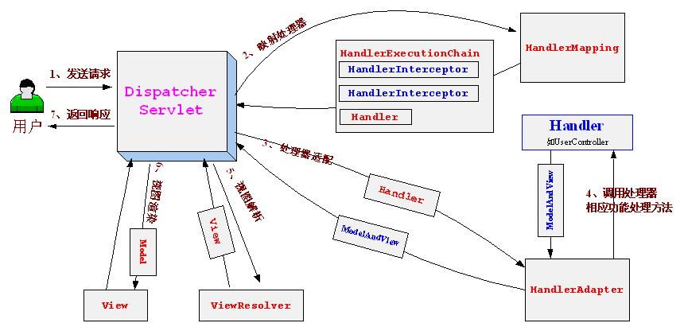

# SpringWebMVC + IDEA + Maven

---
- ## Hello World入门
- ## 依赖jar包：

1. Spring框架jar包：
spring-framework-4.3.7.RELEASE
```xml
<dependency>
    <groupId>org.springframework</groupId>
    <artifactId>spring-webmvc</artifactId>
    <version>4.3.7.RELEASE</version>
</dependency>
```
2. Spring框架依赖的jar包：
需要添加Apache commons logging日志，此处使用的是commons.logging-1.1.1.jar；
需要添加jstl标签库支持，此处使用的是jstl-1.1.2.jar和standard-1.1.2.jar；
```xml
<dependency>
    <groupId>javax.servlet</groupId>
    <artifactId>jstl</artifactId>
    <version>1.2</version>
</dependency>
```

- ## 前端控制器的配置

web.xml
```xml
    <servlet>
        <servlet-name>chapter2</servlet-name>
        <servlet-class>org.springframework.web.servlet.DispatcherServlet</servlet-class>
        <load-on-startup>1</load-on-startup>
    </servlet>
    <servlet-mapping>
        <servlet-name>chapter2</servlet-name>
        <url-pattern>/</url-pattern>
    </servlet-mapping>
```
**load-on-startup**表示启动容器时初始化该Servlet；

**url-pattern**表示哪些请求交给Spring Web MVC处理， “/” 是用来定义默认servlet映射的。也可以如“*.html”表示拦截所有以html为扩展名的请求。

自此请求已交给Spring Web MVC框架处理，因此我们需要配置Spring的配置文件，默认DispatcherServlet会加载`WEB-INF/[DispatcherServlet的Servlet名字]-servlet.xml`配置文件。本示例为`WEB-INF/spring-servlet.xml`

- ## 在Spring配置文件中配置HandlerMapping、HandlerAdapter

具体配置在`WEB-INF/spring-servlet.xml`文件中
```xml
<!-- HandlerMapping -->
<bean class="org.springframework.web.servlet.handler.BeanNameUrlHandlerMapping"/>
 
<!-- HandlerAdapter -->
<bean class="org.springframework.web.servlet.mvc.SimpleControllerHandlerAdapter"/>
```
`InternalResourceViewResolver`：用于支持Servlet、JSP视图解析；

`viewClass`：`JstlView`表示JSP模板页面需要使用JSTL标签库，classpath中必须包含jstl的相关jar包；

` prefix和suffix`：查找视图页面的前缀和后缀（前缀\[逻辑视图名\]后缀），比如传进来的逻辑视图名为hello，则该该jsp视图页面应该存放在`jsp/hello.jsp`

- ## 开发处理器/页面控制器

```java
package cn.javass.chapter2.web.controller;
import javax.servlet.http.HttpServletRequest;
import javax.servlet.http.HttpServletResponse;
import org.springframework.web.servlet.ModelAndView;
import org.springframework.web.servlet.mvc.Controller;
// 页面控制器/处理器必须实现Controller接口，注意别选错了
public class HelloWorldController implements Controller {
    @Override
    // 功能处理方法，实现相应的功能处理，比如收集参数、验证参数、绑定参数到命令对象、将命令对象传入业务对象进行业务处理、最后返回ModelAndView对象
    public ModelAndView handleRequest(HttpServletRequest req, HttpServletResponse resp) throws Exception {
       //1、收集参数、验证参数
       //2、绑定参数到命令对象
       //3、将命令对象传入业务对象进行业务处理
       //4、选择下一个页面
       ModelAndView mv = new ModelAndView();
       //添加模型数据 可以是任意的POJO对象
       mv.addObject("message", "Hello World!");
       //设置逻辑视图名，视图解析器会根据该名字解析到具体的视图页面
       mv.setViewName("hello");
       return mv;
    }
}
```
我们需要将其添加到Spring配置文件(`WEB-INF/spring-servlet.xml`)，让其接受Spring IoC容器管理:

`<bean name="/hello" class="cn.javass.chapter2.web.controller.HelloWorldController"/>`

- ## 开发视图页面

创建 `/jsp/hello.jsp`视图页面
```jsp
<%@ page language="java" contentType="text/html; charset=UTF-8" pageEncoding="UTF-8"%>  
<!DOCTYPE html PUBLIC "-//W3C//DTD HTML 4.01 Transitional//EN" "http://www.w3.org/TR/html4/loose.dtd">  
<html>  
<head>  
<meta http-equiv="Content-Type" content="text/html; charset=UTF-8">  
<title>Hello World</title>  
</head>  
<body>  
${message}  
</body>  
</html>  
```
`${message}`：表示显示由`HelloWorldController`处理器传过来的模型数据

- ## 启动服务器运行测试




运行步骤：
1. 首先用户发送请求`http://localhost:8080/hello`——>`web`容器，web容器根据`/hello`路径映射到`DispatcherServlet（url-pattern为/）`进行处理；
2. `DispatcherServlet`——>`BeanNameUrlHandlerMapping`进行请求到处理的映射，`BeanNameUrlHandlerMapping`将“`/hello`”路径直接映射到名字为“`/hello`”的Bean进行处理，即`HelloWorldController`，`BeanNameUrlHandlerMapping`将其包装为`HandlerExecutionChain`（只包括`HelloWorldController`处理器，没有拦截器）；
3. `DispatcherServlet——> SimpleControllerHandlerAdapter`，`SimpleControllerHandlerAdapter`将HandlerExecutionChain中的处理器（`HelloWorldController`）适配为`SimpleControllerHandlerAdapter`；
4. `SimpleControllerHandlerAdapter`——> `HelloWorldController`处理器功能处理方法的调用，`SimpleControllerHandlerAdapter`将会调用处理器的`handleRequest`方法进行功能处理，该处理方法返回一个`ModelAndView`给`DispatcherServlet`；
5. `hello`（`ModelAndView`的逻辑视图名）——>`InternalResourceViewResolver`， `InternalResourceViewResolver`使用`JstlView`，具体视图页面在`/jsp/hello.jsp`；
6. `JstlView`（`/jsp/hello.jsp`）——>渲染，将在处理器传入的模型数据(`message=HelloWorld！`)在视图中展示出来；
7. 返回控制权给`DispatcherServlet`，由`DispatcherServlet`返回响应给用户，到此一个流程结束。

- ## 主要进行了如下配置：
      
1. 前端控制器DispatcherServlet；
2. HandlerMapping
3. HandlerAdapter
4. ViewResolver
5. 处理器/页面控制器
6. 视图

**参考**<br/>
[HOW2J.CN - SPRING MVC](http://how2j.cn/k/springmvc/springmvc-springmvc/615.html?p=9001) <br/>
[私塾在线](http://sishuok.com/forum/blogPost/list/5160.html) 
